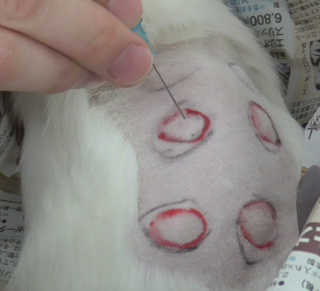
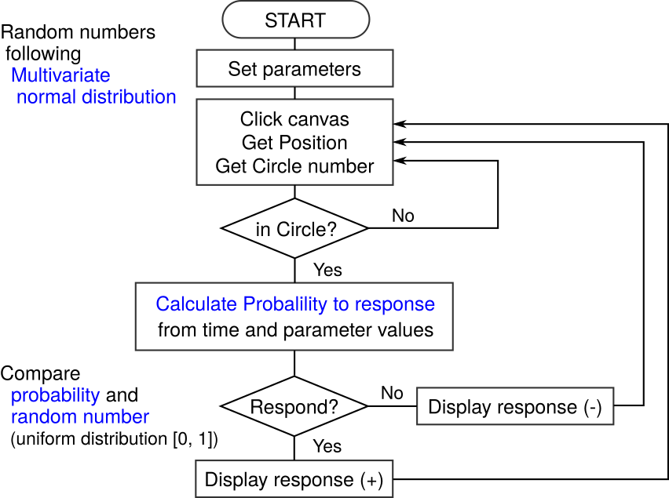

# Summary
`simla-ts` is a web application simulator for local anesthetic agents
used in education of pharmacology written by Typescript.

To confirm the effect of local anesthetic agents
 in the education of pharmacology,
 animal experiments were performed.
One of the animal experiments is to inject local anesthetic agents
 into the back of guinea pigs and
 examine the number of times they responded to needle stimulation.
However,
 from an animal welfare viewpoint [@NAP12910],
 it is desirable to replace the animal experiments with computer simulations.
Therefore,
 we assumed the statistical models and estimated their paramters.
Computer silumation demonstrated that
 the results by these models are similar to those by animal experiments
 [@medicines10110061].
Moreover,
 we assumed the improved statistical model
  that considers the correlation among parameters [@Ara:BioInfoMedicines].

Here,
 we created a web-based simulator for local anesthetic agents
  based on this improved model.
This simulator has the advantage as follows:
(1) the reduction of the number of animals is possible,
(2) The variation in results due to technical errors is small,
 and
(3) This simulator can be run on many operating systems
 including Windows, Mac, Linux, and Android.
We expect that
 this simulator will be widely used in education of pharmacology
 as an alternative to animal experiments.

# Statement of need
As animal welfare becomes increasingly important,
 reducing the number of experimental animals is desirable.
In identifying
 alternatives to animal experiments,
 the 3Rs are an effective strategy.
They are Replacement (directly replace or avoid the use of animals),
 Reduction (obtain comparable information levels from fewer animals), and
 Refinement (minimize or eliminate animals' pain and distress,
 improving their welfare) [@NAP12910].
As an
 alternatives to animal experiments,
 computer simulations are used in areas
 including pharmacokinetics [@COSTANZA20011;@PMID:25845315],
 organ bath systems, and cardiovascular systems
 (Strathclyde Pharmacology Simulations package: OBSim, RatCVS and Virtual Cat)
 [@StrathclydePharmSims].

Animal experiments are a long-used tool
 to evaluate the effect of local anesthetic agents
 in the education of pharmacology
 (\autoref{fig1}).
We have performed this animal experiments
 to investigate the effects of several local anesthetic agents
 on the strength and duration in education of pharmacology.
Importantly,
 vasoconstrictors such as adrenaline,
  which are very often added to local anesthetics,
  prolong thier duration
 [@GoodmanGilman14;@RangDale9].
The educational purpose of these animal experiments is
 to confirm the difference of duration among drugs
  and the effect of vasoconstrictors on duration.
From an animal welfare viewpoint,
 it is necessary to replace this animal experiment
 with computer simulations.
However, to our knowledge,
 there is no simulator aimed at pharmacological effects
 such as intensity or drug effect duration.
Therefore,
 we assumed the statistical models and estimated their paramters
 by Bayesian hierarchical model and Hamiltonian Monte Carlo method
 [@medicines10110061].
Moreover,
 we assumed the improved statistical model
  that considers the correlation among parameters [@Ara:BioInfoMedicines].
Computer silumation demonstrated that
 the results by these models are similar to those by animal experiments.

Here,
 we created a simulator for local anesthetic agents
  based on this improved model
  as a web-based simulator to be able to perform in any environment
  (including Windows, Mac, Linux, and Android).
The flowchart of this simulator is shown in \autoref{fig2}.
This simulator can reproduce
 the difference of duration among drugs
  and the effect of vasoconstrictors on duration.
This `simla-ts` tool will greatly contribute to
 education of pharmacology and
 reducing the number of experimental animals.

{width=40%}

{width=70%}

# Usage
This simulator can be found at
 [https://toshi-ara.github.io/simla-ts/sim_local_anesthetics.html](https://toshi-ara.github.io/simla-ts/sim_local_anesthetics.html).

# Acknowledgements
We thank Prof. Norio Sogawa
 (Institution of Oral Science, Matsumoto Dental University)
  and
 all students for obtaining the animal data in practice of pharmacology.
This work was supported by
 a Scientific Research Special Grant from Matsumoto Dental University.

This project also made use of some of the backbone packages
 including multivariate-normal.

# References
